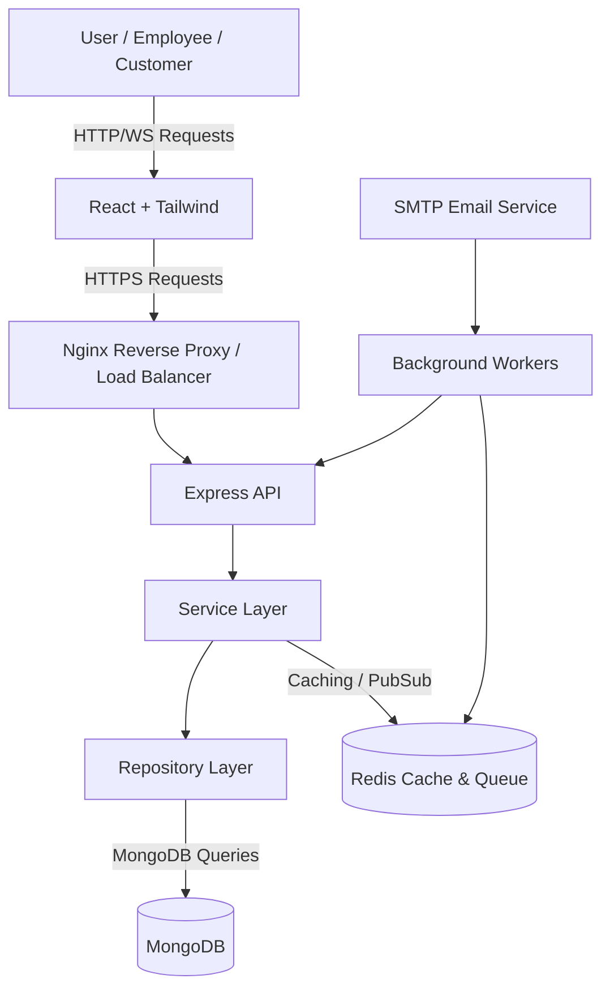
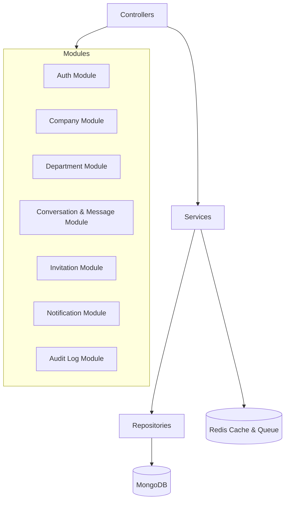
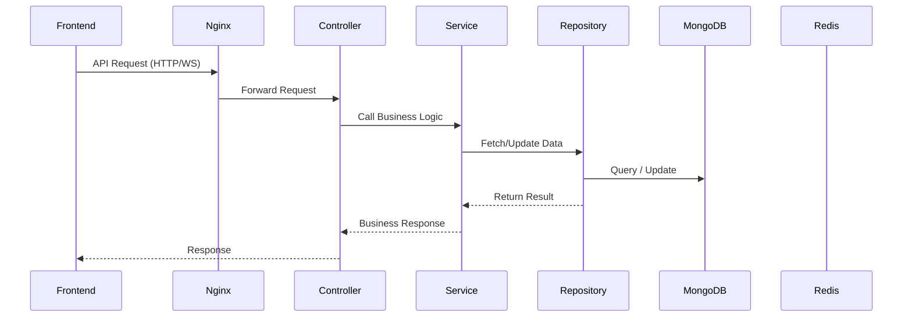
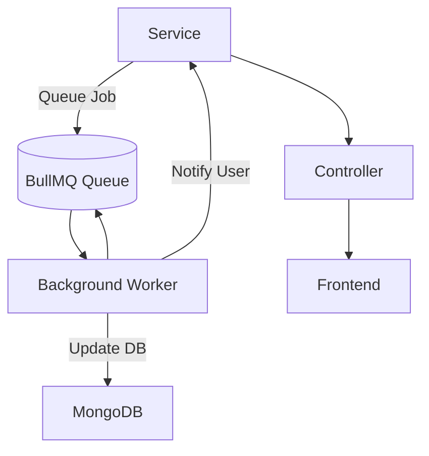
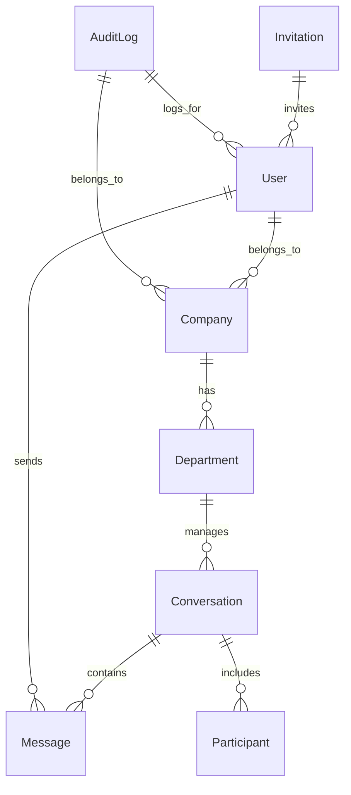
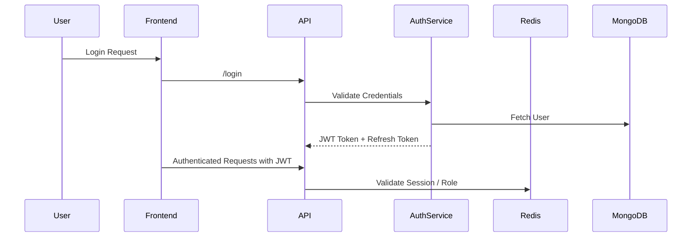

# TokDesk v2 - Enterprise Architecture Document (Updated)

---

# 0. Project Structure

This is the recommended folder/file structure for TokDesk v2:

```
TokDesk-v2/
├── app/
|   ├── constants/           # Roles&Permissions                
│   ├── controllers/         # Request handlers
│   ├── services/            # Business logic
│   ├── repositories/        # DB operations abstraction
│   ├── models/              # Mongoose schemas
│   ├── routes/              # Express routing
│   ├── middlewares/         # Auth, error handling, etc.
│   ├── validators/          # Input validation
│   └── sockets/             # WebSocket / SSE handlers
│
├── config/                  # DB, Redis, Queue, JWT, Cloudinary, Env
├── locales/                 # Multi-language support (i18n)
├── public/                  # Static files (images, uploads, etc.)
├── views/                   # Optional test pages or admin dashboard
├── workers/                 # Background job workers (BullMQ/Redis)
├── queues/                  # Queue definitions (purchaseQueue, notificationQueue)
├── logs/                    # Application logs
├── tests/                   # Unit and integration tests
├── .gitignore               # Standard ignore patterns
├── tok_desk_v_2_roles_permissions.md # Roles & Permissions guide
├── README.md                # Project documentation and overview
├── scenario.md              # Project scenarios / user flows
├── .env                     # Environment variables
├── app.js                   # Express setup only
└── server.js                # HTTP server + Socket.io + Workers initialization
```

**Notes:**

* Each feature/module should have its own controllers/services/repositories structure inside `app/`.
* Validators ensure request data is correct before reaching Controllers.
* Sockets folder handles all real-time communication logic.
* Workers & Queues handle background tasks (notifications, emails, auditing, etc.).
* Config folder centralizes all external service connections.

---

# 1. System Context

TokDesk v2 is a full-stack modular communication and ticketing system. The system interacts with multiple external services and components:



**External Integrations:**

* SMTP / Email Service for notifications
* Cloudinary / S3 for file storage
* Webhooks for third-party integrations

---

# 2. Component Diagram (Internal Architecture)



**Note:**

* AuditModule handles logging of all user actions via **AuditLog** model and background workers.

---

# 3. Request Lifecycle Flow



---

# 4. Async Flow / Background Jobs



**Usage:**

* Sending emails
* Push notifications
* Archiving old conversations
* Audit log processing

---

# 5. Database Schema Overview (ERD)



**Notes:**

* Soft delete is applied to Users, Departments, Conversations, and Messages.
* Indexing applied on frequently queried fields (email, conversationId, departmentId).
* **AuditLog** tracks all user actions across entities; stores optional IP address and details for flexible auditing.

---

# 6. Caching Strategy

* **Redis Cache:**

  * Frequently accessed conversations
  * System announcements
  * User sessions & presence
* **Invalidation Rules:**

  * Update cache on data modification
  * Expire sessions periodically
* **Pub/Sub:**

  * Real-time notifications to multiple server instances

---

# 7. Security & Auth Flow



**Features:**

* JWT Authentication with Refresh Tokens
* Role-Based Access Control (SuperAdmin, CompanyAdmin, Manager, Agent, User)
* Password hashing & rate limiting
* Secure endpoints with middleware validation

---

# 8. DevOps & Deployment

```mermaid
flowchart TD
    Nginx -->|Reverse Proxy| NodeContainers[Node.js App Containers]
    NodeContainers --> Redis[(Redis)]
    NodeContainers --> Mongo[(MongoDB)]
    CI/CD -->|Push| DockerBuild[Docker Image Build]
    DockerBuild --> Kubernetes / Docker Compose
```

**Notes:**

* Docker Compose includes MongoDB, Redis, Nginx, App containers
* Separate `.env` for Dev, Staging, Production
* Nginx handles SSL termination and load balancing

---

# 9. Performance Targets

| Metric                 | Goal            | Tool                        |
| ---------------------- | --------------- | --------------------------- |
| Average Response Time  | < 200ms         | k6 / ApacheBench            |
| Concurrent Connections | 10k+            | Socket.io Cluster           |
| Cache Hit Ratio        | > 85%           | Redis Monitor               |
| Job Processing Time    | < 500ms per job | BullMQ / Custom Worker Logs |

---

# 10. Future Enhancements

* Microservices transition 
* GraphQL API Gateway
* Multi-tenancy per company
* Webhooks & third-party integrations
* Analytics & monitoring dashboards
* Advanced permission rules (ABAC)

---

© 2025 TokDesk Enterprise Architecture - Designed by Basil Saleem
