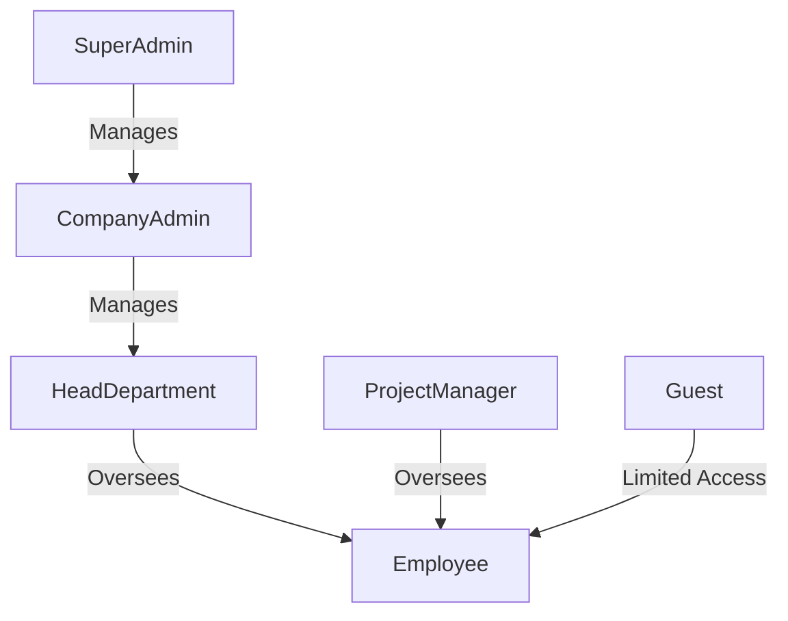

# TokDesk v2 - Roles & Permissions Guide

**Version:** v2 (Professional, Modular, Full-Stack)

**Purpose:** This document serves as a reference and guide for user roles, permissions, and access control in the TokDesk v2 system. It is intended to be included in the repository for developers and future contributors.

---

## 1. Super Admin
**Scope:** System-wide control

**Permissions:**
- **Company Management:** Approve/reject registrations, suspend companies, permanently delete companies.
- **Global Statistics:** View total registered companies, total users, system-wide stats.
- **System Settings:** Configure global policies and notifications.
- **Communication & Notifications:** Send system-wide notifications to Company Admins, manage Super Admin to Admin communications.

---

## 2. Company Admin (Admin)
**Scope:** Entire company management

**Permissions:**
- **Department Management:** Create/update/delete departments, assign heads.
- **Employee Management:** Add/edit/disable/soft delete/permanently delete employees.
- **Project Management:** Create/update/delete projects, assign employees.
- **Conversations:** Create company/project group conversations, edit/delete as needed.
- **Reports & Stats:** Monitor departmental/project performance, employee activity, tickets.
- **Company Settings:** Configure templates, internal notifications, policies.

---

## 3. Head of Department
**Scope:** Department-level control

**Permissions:**
- **Conversations:** Create/edit/delete department/project conversations, manage members.
- **Employee Management:** View employee details and performance within department.
- **Projects:** View department-related projects, participate in project conversations.
- **Reports & Stats:** Department-level performance reports only.

**Restrictions:** Cannot create projects or add/delete employees company-wide.

---

## 4. Employee
**Scope:** Assigned department/project only

**Permissions:**
- **Private Conversations:** 1-to-1 chats within department/project.
- **Group Conversations:** Participate in assigned groups, create sub-chats.
- **Departments & Employees:** View colleagues in their department/project.
- **Reports & Stats:** View task/conversation-level reports where involved.

**Restrictions:** Cannot access company-wide or department-wide reports, cannot manage employees.

---

## 5. Project Manager
**Scope:** Specific project control

**Permissions:**
- **Conversations:** Manage small group conversations within assigned projects.
- **Participation:** Join existing project conversations.
- **Projects & Employees:** View projects they manage.

**Restrictions:** Cannot create company-wide conversations or manage employees beyond assigned projects.

---

## 6. Guest / External User
**Scope:** Invited projects/conversations only

**Permissions:**
- Participate only in invited conversations and projects.
- Create 1-to-1 chats within invited groups.
- Follow up on tasks related to them.

**Restrictions:** Cannot create/edit/delete projects or conversations outside invitation scope, cannot access employees/departments not invited to.

---

## 7. RBAC Visualization (Mermaid)

---

**Notes for Developers:**
- Implement RBAC checks at **Controller/Service level**.
- Support **dynamic role assignment** for future features.
- Ensure multi-language support and permission descriptions are translatable.
- Integrate logging for sensitive actions performed by Admins/Super Admins.

© 2025 TokDesk v2 - Roles & Permissions Guide

